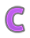
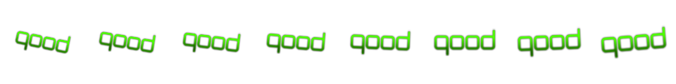
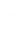

# Skinning the Gameplay Interface
The gameplay interface includes general skin elements that are present in all game modes. It includes elements such as number displays, scoreboards, judgements,
and more.

## Cursor ##

### Main Cursor ###

`/Cursor/main-cursor.png`

| Animatable | Alignment | Suggested Size |
|:-:|:-:|:-:|
| No | MidCenter | None |

**Notes:**

- The mouse cursor that is displayed.
- Hidden during gameplay. Active during menu navigation.

**skin.ini Values:**

- None

## Grades ##

### Grade Small A ###

`/Grades/grade-small-a.png`

| Animatable | Alignment | Suggested Size |
|:-:|:-:|:-:|
| No | - | None |

**Notes:**

- The sprite that is displayed next to the accuracy when having 90-94%.
- Displayed in the results screen.
- Displayed in the song select screen leaderboards.

**skin.ini Values:**

- None

---

### Grade Small B ###

`/Grades/grade-small-b.png`

| Animatable | Alignment | Suggested Size |
|:-:|:-:|:-:|
| No | - | None |

**Notes:**

- The sprite that is displayed next to the accuracy when having 80-89%.
- Displayed in the results screen.
- Displayed in the song select screen leaderboards.

**skin.ini Values:**

- None

---

### Grade Small C ###

`/Grades/grade-small-c.png`

| Animatable | Alignment | Suggested Size |
|:-:|:-:|:-:|
| No | - | None |

**Notes:**

- The sprite that is displayed next to the accuracy when having 70-79%.
- Displayed in the results screen.
- Displayed in the song select screen leaderboards.

**skin.ini Values:**

- None

---

### Grade Small D ###

`/Grades/grade-small-d.png`

| Animatable | Alignment | Suggested Size |
|:-:|:-:|:-:|
| No | - | None |

**Notes:**

- The sprite that is displayed next to the accuracy when having less than 70%.
- Displayed in the results screen.
- Displayed in the song select screen leaderboards.

**skin.ini Values:**

- None

---

### Grade Small F ###

`/Grades/grade-small-f.png`

| Animatable | Alignment | Suggested Size |
|:-:|:-:|:-:|
| No | - | None |

**Notes:**

- The sprite that is displayed next to the accuracy when failing a map.
- Displayed in the results screen.
- Displayed in the song select screen leaderboards.

**skin.ini Values:**

- None

---

### Grade Small S ###

`/Grades/grade-small-s.png`

| Animatable | Alignment | Suggested Size |
|:-:|:-:|:-:|
| No | - | None |

**Notes:**

- The sprite that is displayed next to the accuracy when having 95-98%.
- Displayed in the results screen.
- Displayed in the song select screen leaderboards.

**skin.ini Values:**

- None

---

### Grade Small SS ###

`/Grades/grade-small-ss.png`

| Animatable | Alignment | Suggested Size |
|:-:|:-:|:-:|
| No | - | None |

**Notes:**

- The sprite that is displayed next to the accuracy when having 99%.
- Displayed in the results screen.
- Displayed in the song select screen leaderboards.

**skin.ini Values:**

- None

---

### Grade Small X ###

`/Grades/grade-small-x.png`

| Animatable | Alignment | Suggested Size |
|:-:|:-:|:-:|
| No | - | None |

**Notes:**

- The sprite that is displayed next to the accuracy when having 100% while having perfect judgements.
- Displayed in the results screen.
- Displayed in the song select screen leaderboards.

**skin.ini Values:**

- None

---

### Grade Small XX ###

`/Grades/grade-small-xx.png`

| Animatable | Alignment | Suggested Size |
|:-:|:-:|:-:|
| No | - | None |

**Notes:**

- The sprite that is displayed next to the accuracy when having 100% with all marv judgements.
- Displayed in the results screen.
- Displayed in the song select screen leaderboards.

**skin.ini Values:**

- None

---

## Health Bar ##

### Health Bar Background ###

`/Health/health-background.png`

| Animatable | Alignment | Suggested Size |
|:-:|:-:|:-:|
| Yes | Depends | 600x40 if horizontal. 40x600 if vertical |

**Notes:**

- Spritesheet animation file name: `/Health/health-background@{rows}x{columns}.png`
- Displayed as the background health bar. This one does not change and only serves as the background of the health gauge.

**skin.ini Values:**

| Name | Possible Values | Notes |
|:-:|:-:|:-:|
| HealthBarType | `Horizontal` or `Vertical` | If your image is horizontal, set it to horizontal. If vertical, set it to vertical. |
| HealthBarKeysAlignment | `RightStage`, `LeftStage`, or `TopLeft` | Determines where to place the health bar in the Keys game mode.

---

### Health Bar Foreground ###

`/Health/health-foreground.png`

| Animatable | Alignment | Suggested Size |
|:-:|:-:|:-:|
| Yes | Depends | 600x40 if horizontal. 40x600 if vertical |

**Notes:**

- Spritesheet animation file name: `/Health/health-foreground@{rows}x{columns}.png`
- Displayed in the foreground. This is the healthbar that moves according to the current health.

**skin.ini Values:**

| Name | Possible Values | Notes |
|:-:|:-:|:-:|
| HealthBarType | `Horizontal` or `Vertical` | If your image is horizontal, set it to horizontal. If vertical, set it to vertical. |
| HealthBarKeysAlignment | `RightStage`, `LeftStage`, or `TopLeft` | Determines where to place the health bar in the Keys game mode.

## Judgements ##

### Judgement Overlay ###

`/Judgements/judgement-overlay.png`

| Animatable | Alignment | Suggested Size |
|:-:|:-:|:-:|
| No | MidRight | 100x100 |

**Notes:**

- Background image that displays the current judgements the player has.
- Automatically colored according to the [JudgeColors skin.ini value]()
- Should be white!

**skin.ini Values:**

| Name | Possible Values | Notes |
|:-:|:-:|:-:|
| JudgeColor{Marv-Miss} | RGB Color (255,255,255) | The overlay is tinted according to these skin.ini values. 

---

### Judgement (Marv) ###

`/Judgements/judge-marv.png`

| Animatable | Alignment | Suggested Size |
|:-:|:-:|:-:|
| Yes | MidCenter | - |

**Notes:**

- Spritesheet animation name: `/Judgements/judge-marv@{rows}x{columns}.png`
- Displayed when a judgement is received after hitting an object.
- If no spritesheet is specified, it will perform a default animation.

**skin.ini Values:**

| Name | Possible Values | Notes |
|:-:|:-:|:-:|
| JudgementHitBurstScale | Float | This value is multiplied to increase/decrease the size of the judgement hit burst.
| JudgementBurstPosY | Integer | Determines the y position of this sprite.

--- 

### Judgement (Perf) ###

`/Judgements/judge-perf.png`

| Animatable | Alignment | Suggested Size |
|:-:|:-:|:-:|
| Yes | MidCenter | - |

**Notes:**

- Spritesheet animation name: `/Judgements/judge-perf@{rows}x{columns}.png`
- Displayed when a judgement is received after hitting an object.
- If no spritesheet is specified, it will perform a default animation.

**skin.ini Values:**

| Name | Possible Values | Notes |
|:-:|:-:|:-:|
| JudgementHitBurstScale | Float | This value is multiplied to increase/decrease the size of the judgement hit burst.
| JudgementBurstPosY | Integer | Determines the y position of this sprite.

--- 

### Judgement (Great) ###

`/Judgements/judge-great.png`

| Animatable | Alignment | Suggested Size |
|:-:|:-:|:-:|
| Yes | MidCenter | - |

**Notes:**

- Spritesheet animation name: `/Judgements/judge-great@{rows}x{columns}.png`
- Displayed when a judgement is received after hitting an object.
- If no spritesheet is specified, it will perform a default animation.

**skin.ini Values:**

| Name | Possible Values | Notes |
|:-:|:-:|:-:|
| JudgementHitBurstScale | Float | This value is multiplied to increase/decrease the size of the judgement hit burst.
| JudgementBurstPosY | Integer | Determines the y position of this sprite.

--- 

### Judgement (Good) ###

`/Judgements/judge-good.png`

| Animatable | Alignment | Suggested Size |
|:-:|:-:|:-:|
| Yes | MidCenter | - |

**Notes:**

- Spritesheet animation name: `/Judgements/judge-good@{rows}x{columns}.png}`
- Displayed when a judgement is received after hitting an object.
- If no spritesheet is specified, it will perform a default animation.

**skin.ini Values:**

| Name | Possible Values | Notes |
|:-:|:-:|:-:|
| JudgementHitBurstScale | Float | This value is multiplied to increase/decrease the size of the judgement hit burst.
| JudgementBurstPosY | Integer | Determines the y position of this sprite.

--- 

### Judgement (Okay) ###

`/Judgements/judge-okay.png`

| Animatable | Alignment | Suggested Size |
|:-:|:-:|:-:|
| Yes | MidCenter | - |

**Notes:**

- Spritesheet animation name: `/Judgements/judge-okay@{rows}x{columns}.png`
- Displayed when a judgement is received after hitting an object.
- If no spritesheet is specified, it will perform a default animation.

**skin.ini Values:**

| Name | Possible Values | Notes |
|:-:|:-:|:-:|
| JudgementHitBurstScale | Float | This value is multiplied to increase/decrease the size of the judgement hit burst.
| JudgementBurstPosY | Integer | Determines the y position of this sprite.

--- 

### Judgement (Miss) ###

`/Judgements/judge-miss.png`

| Animatable | Alignment | Suggested Size |
|:-:|:-:|:-:|
| Yes | MidCenter | - |

**Notes:**

- Spritesheet animation name: `/Judgements/judge-miss@{rows}x{columns}.png`
- Displayed when a judgement is received after missing a hitobject.
- If no spritesheet is specified, it will perform a default animation.

**skin.ini Values:**

| Name | Possible Values | Notes |
|:-:|:-:|:-:|
| JudgementHitBurstScale | Float | This value is multiplied to increase/decrease the size of the judgement hit burst.
| JudgementBurstPosY | Integer | Determines the y position of this sprite.

## Numbers ##

### Combo Display Numbers ###

`/Numbers/combo-{0-9}.png`

| Animatable | Alignment | Suggested Size |
|:-:|:-:|:-:|
| No | MidCenter | - |

**Notes:**

- Represents the number {0-9} that displays the player's current combo.

**skin.ini Values:**

| Name | Possible Values | Notes |
|:-:|:-:|:-:|
| ComboPosY | Integer | Determines the y value of where to place the combo display.

--- 

### Score/Accuracy Numbers ###

`/Numbers/score-{0-9}.png`

| Animatable | Alignment | Suggested Size |
|:-:|:-:|:-:|
| No | Depends. TopLeft if score. TopRight if accuracy. | - |

**Notes:**

- Represents the number {0-9} that displays the player's current score and accuracy

**skin.ini Values:**

| Name | Possible Values | Notes |
|:-:|:-:|:-:|
| ScoreDisplayPosX and AccuracyDisplayPosX | Integer | Determines the x position of the display relative to the alignment.
| ScoreDisplayPosY and AccuracyDisplayPosX | Integer | Determines the y position of the display relative to the alignment.

--- 

### Score Display Percent ###

`/Numbers/score-percent.png`

| Animatable | Alignment | Suggested Size |
|:-:|:-:|:-:|
| No | TopRight | - |

**Notes:**

- Represents the `%` symbol in the user's accuracy.

**skin.ini Values:**

| Name | Possible Values | Notes |
|:-:|:-:|:-:|
| AccuracyDisplayPosX | Integer | Determines the x position of the display relative to the alignment.
| AccuracyDisplayPosX | Integer | Determines the y position of the display relative to the alignment.

---

### Score Display Decimal ###

`/Numbers/score-decimal.png`

| Animatable | Alignment | Suggested Size |
|:-:|:-:|:-:|
| No | TopRight | - |

**Notes:**

- Represents the `.` symbol in the user's accuracy.

**skin.ini Values:**

| Name | Possible Values | Notes |
|:-:|:-:|:-:|
| AccuracyDisplayPosX | Integer | Determines the x position of the display relative to the alignment.
| AccuracyDisplayPosX | Integer | Determines the y position of the display relative to the alignment.

---

### Song Time Display Numbers ###

`/Numbers/song-time-{0-9}.png`

| Animatable | Alignment | Suggested Size |
|:-:|:-:|:-:|
| No | BottomLeft / BottomRight | - |

**Notes:**

- Numbers that display the current song time and time left.

**skin.ini Values:**

* None

---

### Song Time Display Colon ###

`/Numbers/song-time-colon.png`

| Animatable | Alignment | Suggested Size |
|:-:|:-:|:-:|
| No | BottomLeft / BottomRight | - |

**Notes:**

- Displays the `:` character in the song time display.

**skin.ini Values:**

* None

---

### Song Time Display Minus ###

`/Numbers/song-time-minus.png`

| Animatable | Alignment | Suggested Size |
|:-:|:-:|:-:|
| No | BottomLeft / BottomRight | - |

**Notes:**

- Displays the `-` character in the song time display.

**skin.ini Values:**

* None

## Pause Screen ##

### Pause Continue Button ###

`/Pause/pause-continue.png`

| Animatable | Alignment | Suggested Size |
|:-:|:-:|:-:|
| No | MidCenter | - |

**Notes:**

- The button to continue the map in the pause screen.

**skin.ini Values:**

* None

--- 

### Pause Retry Button ###

`/Pause/pause-retry.png`

| Animatable | Alignment | Suggested Size |
|:-:|:-:|:-:|
| No | MidCenter | - |

**Notes:**

- The button to retry the map in the pause screen.

**skin.ini Values:**

* None

---

### Pause Back Button ###

`/Pause/pause-back.png`

| Animatable | Alignment | Suggested Size |
|:-:|:-:|:-:|
| No | MidCenter | - |

**Notes:**

- The button to quit the map in the pause screen.

**skin.ini Values:**

* None

---

### Pause Background ###

`/Pause/pause-background.png`

| Animatable | Alignment | Suggested Size |
|:-:|:-:|:-:|
| No | MidCenter | - |

**Notes:**

- Background image that displayed during the pause screen. If none is specified, it will dim to black.

**skin.ini Values:**

* None

## Scoreboard ##

### Scoreboard User ###

`/Scoreboard/scoreboard.png`

| Animatable | Alignment | Suggested Size |
|:-:|:-:|:-:|
| No | MidLeft | - |

**Notes:**

- Background image is displayed for the current player on the scoreboard.

**skin.ini Values:**

* None

---

### Scoreboard Other ###

`/Scoreboard/scoreboard-other.png`

| Animatable | Alignment | Suggested Size |
|:-:|:-:|:-:|
| No | MidLeft | - |

**Notes:**

- Background image is displayed for the all other players in the scoreboard (not including the player themselves)

**skin.ini Values:**

* None

