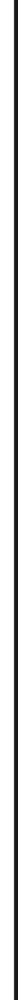
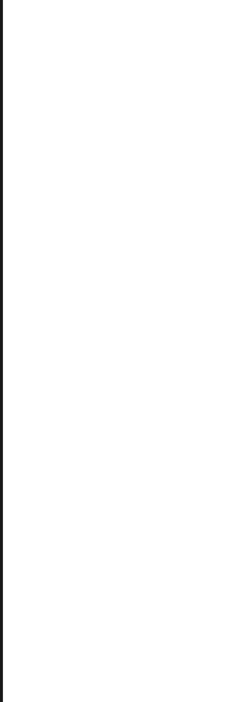

# Skinning the Keys game mode (4K and 7K)
The following are the list of elements to customize the Keys game mode. This includes 4K and 7K.

**Note: All elements in this case must be in either a folder titled `4k` or `7k` depending on which game mode you wish the element to be for.**

## Column ##

`/4k/Column/column-lighting.png`

`/7k/Column/column-lighting.png`

| Animatable | Alignment | Suggested Size |
|:-:|:-:|:-:|
| No | MidCenter | - |

**Notes:**

- The sprite that is displayed that lights up the column when holding down the respective input key.

**skin.ini Values:**

| Name | Possible Values | Notes |
|:-:|:-:|:-:|
| ColumnLightingScale | Float | The y size scale of the column lighting.

## Lighting ##

`/4k/Lighting/hitlighting.png`

`/7k/Lighting/hitlighting.png`

| Animatable | Alignment | Suggested Size |
|:-:|:-:|:-:|
| Yes | MidCenter | - |

**Notes:**

- Spritesheet animation name for 4K: `/4k/Lighting/hitlighting@{rows}x{columns}.png`
- Spritesheet animation name for 7K: `/7k/Lighting/hitlighting@{rows}x{columns}.png`
- When hitting an object, an animation will play to give feedback to the user.
- If animation frames are given, it it is played at 180 FPS.
- If no animation frames are given, a default animation is played.

**skin.ini Values:**

| Name | Possible Values | Notes |
|:-:|:-:|:-:|
| HitLightingWidth | Integer | The width of the lighting |
| HitLightingHeight | Integer | The height of the lighting |
| HitLightingY | Integer | The y position of the lighting |

---

`/4k/Lighting/holdlighting.png`

`/7k/Lighting/holdlighting.png`

| Animatable | Alignment | Suggested Size |
|:-:|:-:|:-:|
| Yes | MidCenter | - |

**Notes:**

- Spritesheet animation name for 4K: `/4k/Lighting/holdlighting@{rows}x{columns}.png`
- Spritesheet animation name for 7K: `/7k/Lighting/holdlighting@{rows}x{columns}.png`
- When hold a long note, an animation will play to give feedback to the user.
- If animation frames are given, it it is played at 180 FPS.
- If no animation frames are given, a default animation is played.

**skin.ini Values:**

| Name | Possible Values | Notes |
|:-:|:-:|:-:|
| HitLightingWidth | Integer | The width of the lighting |
| HitLightingHeight | Integer | The height of the lighting |
| HitLightingY | Integer | The y position of the lighting |

## Notes ##

### HitObjects ###

### HoldHitObjects ###

### HoldBodies ###

### HoldEnds ###

## Receptors ##

`/4k/Receptors/Up/receptor-up-{1-7}.png`

`/7k/Receptors/Up/receptor-up-{1-7}.png`

| Animatable | Alignment | Suggested Size |
|:-:|:-:|:-:|
| No | TopLeft | Square Image (256x256) |

**Notes:**

- The image displayed when the input key is not pressed.

**skin.ini Values:**

| Name | Possible Values | Notes |
|:-:|:-:|:-:|
| ReceptorPosOffsetY | Integer | The y position offset of the receptors relative to the bottom/top of the stage |
| ColumnSize | Integer | Increases the width of the receptors.
| ReceptorsOverHitObjects | True or False | If true, the receptors will be over the hitobjects when they fall down.

---

`/4k/Receptors/Down/receptor-down-{1-7}.png`

`/7k/Receptors/Down/receptor-down-{1-7}.png`

| Animatable | Alignment | Suggested Size |
|:-:|:-:|:-:|
| No | TopLeft | Square Image (256x256) |

**Notes:**

- The image displayed when the input key is pressed.

**skin.ini Values:**

| Name | Possible Values | Notes |
|:-:|:-:|:-:|
| ReceptorPosOffsetY | Integer | The y position offset of the receptors relative to the bottom/top of the stage |
| ColumnSize | Integer | Increases the width of the receptors. |
| ReceptorsOverHitObjects | True or False | If true, the receptors will be over the hitobjects when they fall down. |
 
## Stage ##

`/4k/Stage/stage-bgmask.png`

`/7k/Stage/stage-bgmask.png`

| Animatable | Alignment | Suggested Size |
|:-:|:-:|:-:|
| No | MidCenter | - |

**Notes:**

- The stage's background. Notes fall in front of this area.

**skin.ini Values:**

| Name | Possible Values | Notes |
|:-:|:-:|:-:|
| BgMaskAlpha | Float (0.0-1.0) | The alpha channel/opacity of the bg mask.

---

`/4k/Stage/stage-distant-overlay.png`

`/7k/Stage/stage-distant-overlay.png`

| Animatable | Alignment | Suggested Size |
|:-:|:-:|:-:|
| No | TopCenter | - |

**Notes:**

- Displayed at the top center of the stage. Commonly used for covering notes at the top of the screen.

**skin.ini Values:**

- None

---

`/4k/Stage/stage-hitposition-overlay.png`

`/7k/Stage/stage-hitposition-overlay.png`

| Animatable | Alignment | Suggested Size |
|:-:|:-:|:-:|
| No | MidCenter | - |

**Notes:**

- An image that is directly over the hitposition, used to indicate where the player should hit.

**skin.ini Values:**

- None

---

`/4k/Stage/stage-left-border.png`

`/7k/Stage/stage-left-border.png`

| Animatable | Alignment | Suggested Size |
|:-:|:-:|:-:|
| No | TopLeft | - |

**Notes:**

- Displayed at the left of the stage. Used purely for aesthetics.

**skin.ini Values:**

- None

---

`/4k/Stage/stage-right-border.png`

`/7k/Stage/stage-right-border.png`

| Animatable | Alignment | Suggested Size |
|:-:|:-:|:-:|
| No | TopRight | - |

**Notes:**

- Displayed at the right of the stage. Used purely for aesthetics.

**skin.ini Values:**

- None